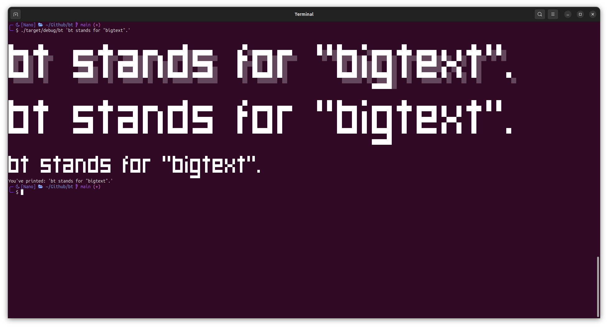
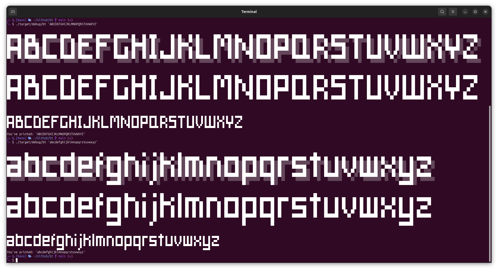
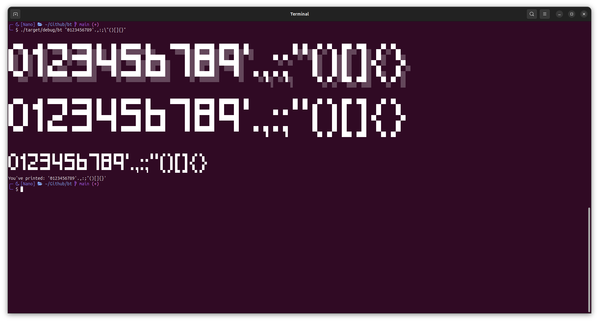

# bt

_bt stands for "big text"._

## WIP!

This is just an idea and a work in progress. There's still a lot to do (i.e. make a proper readme haha).

## Summary

Print text in the terminal a la toilet/figlet, with a big, blocky font.

You can pipe the result in **Vim**, **Neovim**, **Helix**, etc to have nice headings in your files.

A half-size font/option is provided, along with different shadows.

## Examples

### Alphabet:

### Numbers and punctuation:

